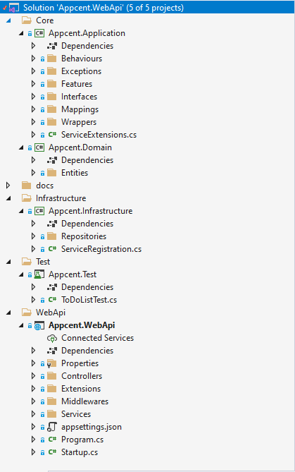
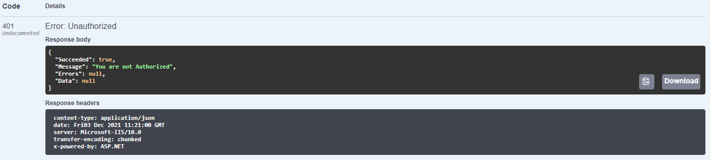
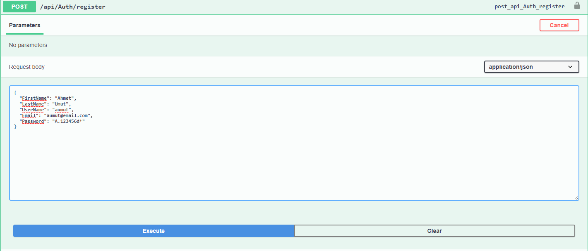
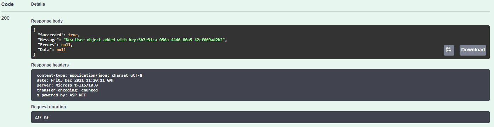
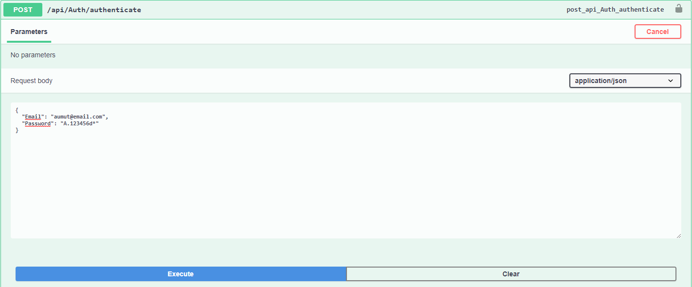
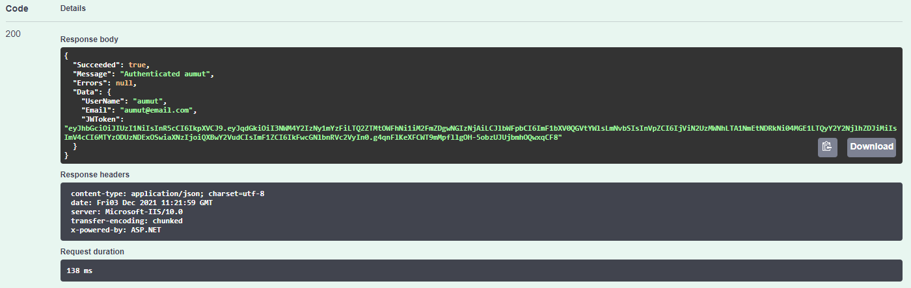
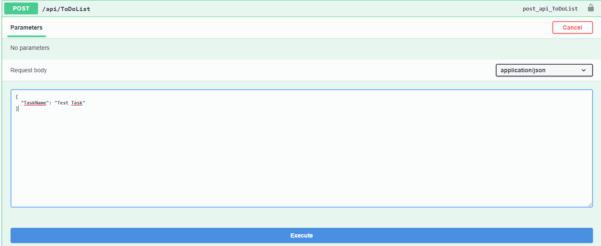
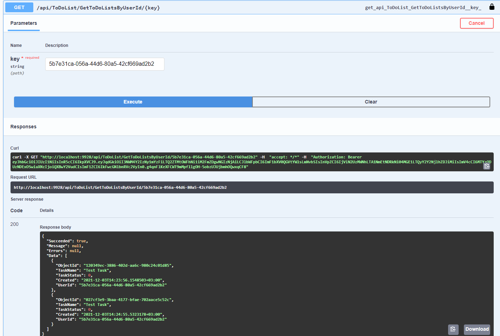
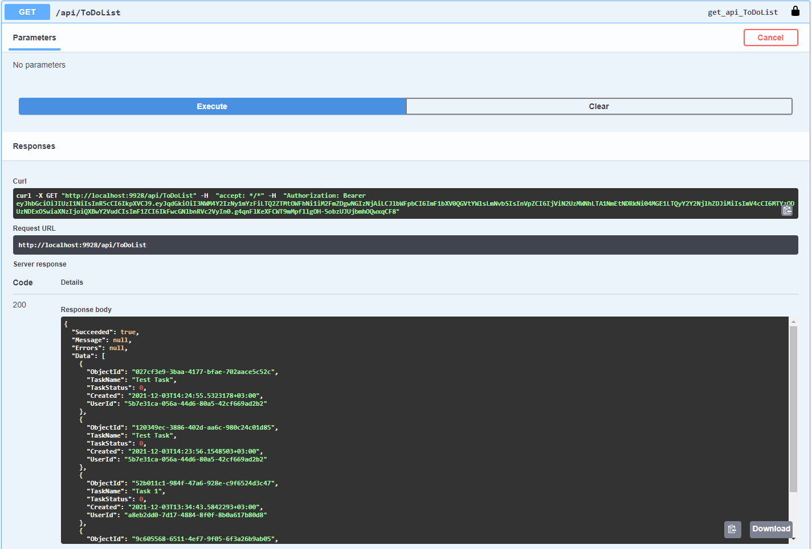

# Appcent.NetCoreCase

 ToDoList using 'Clean Architecture Principles' and CQRS

Technology Stack:
- .NET Core
- Couchbase
- Swagger
- Docker
- Nunit and Moq
- Automapper
- FluentValidation
- MediatR
- JWT

# Project Structure



# Install

You will need to setup Couchbase Server for project to work. First install Docker and make sure it's working properly. ([See](https://www.docker.com/get-started)) If you already have installed on your pc;

```PowerShell
docker run -d --name db -p 8091-8096:8091-8096 -p 11210-11211:11210-11211 couchbase
```

After that you need to setup a cluster. You can check offical document ([here](https://docs.couchbase.com/server/current/install/getting-started-docker.html))

Go to Appcent.NetCoreCase/Appcent.WebApi/appsettings.json configure your connection settings. After your configuration, start the project and you should see SwaggerUI screen.

# Next Step

Now you need to create an account to use to project. Otherwise you will get 401 error.



Simply just go to register method and create an account.



You should get following response if nothing went wrong :)



Now go to authenticate method and login with your credentials.



You should get following response if nothing went wrong :)



Get the token from the response and authorize swagger now you should be good.

# Create Your First To-Do






